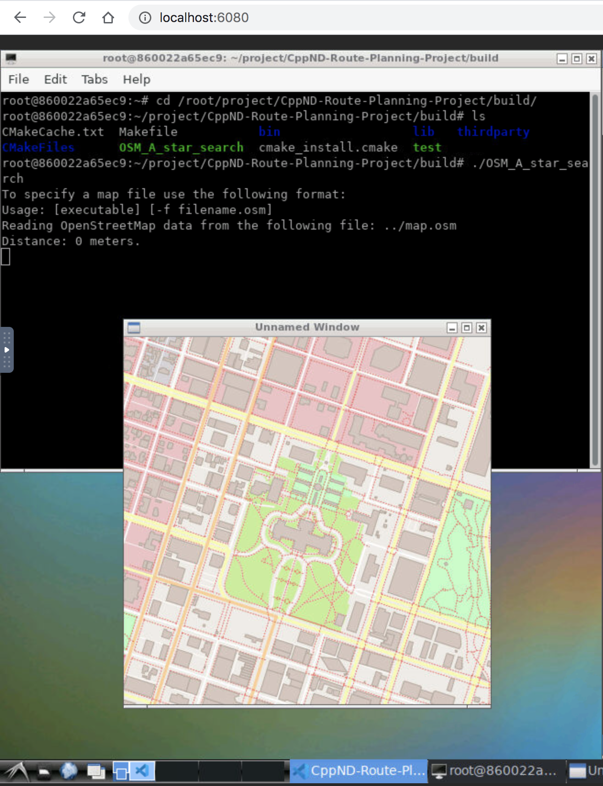

# Container environment 

This provides a Dockerfile which can be used to build a Docker image locally and run a container for the environment setup of this project. It is an Ubuntu environemt with an LXDE desktop, based on an [existing Docker image](https://hub.docker.com/r/dorowu/ubuntu-desktop-lxde-vnc/). The instructions on the Dockerfile install all the needed dependencies, including VS Code and IO2D.

## Setup

* Clone the project or your own fork:

```
git clone --recurse-submodules https://github.com/udacity/CppND-Route-Planning-Project
```

* Build the Docker image:

```bash
docker build -t environment-cpp-project-1 .
```

* Run the Docker container, by mounting the project's directory from your host to the container:

```bash
docker run -p 6080:80 -v /dev/shm:/dev/shm \
	-v <path-to-project>:/root/project/CppND-Route-Planning-Project \
	environment-cpp-project-1
```

* Open `http://localhost:6080/` on your browser to see the Ubuntu Desktop.

* Open the terminal in Ubuntu to build and execute the project:

```bash
cd /root/project/CppND-Route-Planning-Project
mkdir build
cd build
cmake ..
make
./OSM_A_star_search
```

You should see the output below and at this point can continue working locally on the project.

